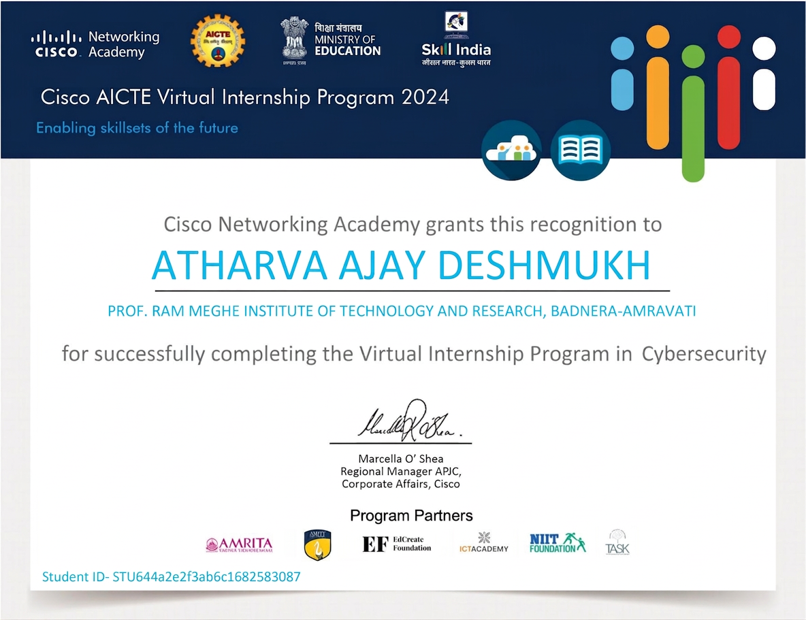

# Campus Network Topology Simulation using Cisco Packet Tracer

This repository contains the capstone project completed during the Cisco Virtual Internship (AICTE - EduSkills).

The project focuses on designing and simulating a structured college campus network using Cisco Packet Tracer, mapping its logical architecture, and analyzing its overall structural layout from a foundational networking perspective.

---

## Problem Statement

Educational institutions rely heavily on reliable, segmented, and well-documented network infrastructures to connect various academic, administrative, and backend services. Managing this scale requires a clear division of network traffic to minimize broadcast domains, isolate departmental operations, and ensure seamless server visibility.

### Objectives:
1. **Topology Analysis:** Conduct an analysis of the campus network layout, tracking device distribution, interconnectivity, and communication pathways across diverse blocks.
2. **Network Mapping:** Utilize Cisco Packet Tracer to construct and simulate the infrastructure, accurately modeling the core layer, access switches, end devices, and central server assets.
3. **Attack Surface Identification:** Map the overall architecture to locate potential structural risks—such as wide broadcast domains, single points of failure, or unsegmented paths—that could impact availability or traffic isolation.

---

## Project Contributors

* **Atharva A. Deshmukh**
* **Mahesh P. Dahake**
* **Jayesh N. Gatfane**

---

## Project Overview

The campus network is built around a centralized multilayer core switch that connects multiple departmental networks. Each department is segmented into its own virtual local area network (VLAN) to limit broadcast traffic and achieve logical separation across the campus environment.

The topology includes:
* **Core Layer:** Centralized Multilayer Switch managing routing.
* **Access Layer:** Independent Departmental Access Switches.
* **End Devices:** Dedicated workstation PCs and local Network Printers.
* **Server Farm:** Centralized application, database, and software-specific servers.

---

## Departments & VLANs

| Department | VLAN | IP Subnet |
| :--- | :--- | :--- |
| Mechanical | 10 | 192.168.1.0/24 |
| Civil | 20 | 192.168.2.0/24 |
| E&TC | 30 | 192.168.3.0/24 |
| First Year | 40 | 192.168.4.0/24 |
| Main Office | 50 | 192.168.5.0/24 |
| Library | 60 | 192.168.6.0/24 |
| Computer / IT | 70 / 80 | 192.168.7.0/24 & 192.168.8.0/24 |
| Sports | 90 | 192.168.9.0/24 |
| Workshop | 100 | 192.168.10.0/24 |

---

## Infrastructure Breakdown

### Core Layer
* **Cisco 3560 Multilayer Switch:** Acts as the central hub of the campus topology, connecting all access layer switches and the server farm.

### Access Layer
* **Cisco 2960 24-Port Switches:** Deployed department-by-department to deliver local access connectivity.

### Server Farm Units
* **VLSI & Micro Wind Servers:** Tailored for core engineering laboratory workflows.
* **ERP & Database Servers:** Manage administrative automation, student documentation, and central storage.
* **MATLAB & Rational Rose Servers:** Provide centralized computing resources for software labs.
* **Linux, Backup, and Antivirus Servers:** Host general operating systems, network backups, and centralized update clients.

---

## Topology Visuals

### Complete Network Layout
A holistic overview of the entire simulated campus network showing the core Layer 3 switch, backend servers, and the distribution across academic and administrative departments.

---

### Dedicated Server Farm
A detailed close-up of the centralized server cluster hosting critical campus infrastructure applications, databases, development setups, and utility servers.

---

### Core Layer 3 Switch and Core Departmental Subnets
An isolated view highlighting the central 3650 Multilayer Switch handling inter-VLAN routing for the initial department blocks (VLANs 10 through 40).

.png)

---

### Administrative and Academic Subnets
A granular view of the administrative zones (Main Office, Library) and specialized academic engineering branches (IT, Computer, Sports, and Workshop) mapping out VLANs 50 through 100.

.png)

---

## Implementation Summary

* Built the complete multi-tier campus layout inside Cisco Packet Tracer.
* Set up a centralized Layer 3 switching hub to maintain routing boundaries.
* Configured logical subnets (`/24`) and separate VLAN IDs for 10 distinct operational zones.
* Validated cross-network endpoint-to-printer and endpoint-to-server paths.
* Examined the layout's structural attack surface to recommend standard network resilience upgrades.

---

## Architectural & Security Analysis

Evaluating the physical and logical configuration highlighted several core areas for future enhancement:
* **Unrestricted Default Access:** Standard multi-layer switch defaults permit open traffic routing across all configured VLAN departments.
* **Single Point of Failure:** Relying on one core multilayer switch introduces structural risks if that node experiences downtime.
* **Open Server Resources:** Application servers share open broadcast interfaces with standard endpoint workstations.

### Core Recommendations:
* Introduce Access Control Lists (ACLs) to manage traffic filtering rules between academic and administrative segments.
* Deploy a dedicated Server-VLAN zone to isolate backend assets from desktop environments.
* Introduce redundant core trunk configurations to safeguard general uptime.

---

## Certification

This project was developed as part of the **Cisco Virtual Internship Program** supported by **AICTE** and **EduSkills**. 

---
